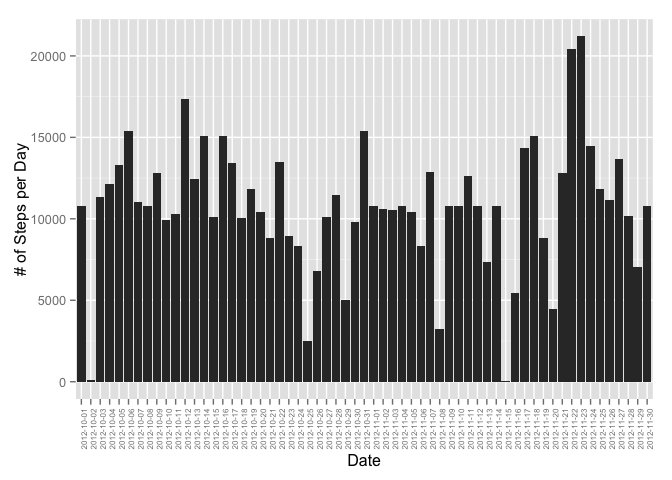

# Reproducible Research: Peer Assessment 1


## Loading and preprocessing the data

If "activity" data set does not exist in work directory, it is downloaded from the web. Data is loaded to data frame using read.csv() and unz() as activity data set is zipped in activity.zip file.

For plotting, ggplot2 will be used.


```r
library(ggplot2)
library(knitr)
options(scipen = 1, digits = 2)

fileURL <- "https://d396qusza40orc.cloudfront.net/repdata%2Fdata%2Factivity.zip"
if(!file.exists("activity.zip")) {
        download.file(fileURL, "activity.zip")
}
data <- read.csv(unz("activity.zip","activity.csv"))
```

## What is mean total number of steps taken per day?

To calculate the total number of steps taken per day steps are aggregated by day. For each day in data set, number of steps are calculated and then ploted in a histogram.


```r
aggData <- aggregate(data$steps, by = list(data$date), "sum")
colnames(aggData) <- c("date", "steps")

g <- ggplot(aggData, aes(x=date, y=steps)) + geom_bar(stat="identity") +
        ylab("# of Steps per Day") + xlab("Date") +
        theme(axis.text.x = element_text(angle=90, size = 6))
print(g)
```

```
## Warning: Removed 8 rows containing missing values (position_stack).
```

 


```r
meanStepsPerDay <- mean(aggData$steps, na.rm = TRUE)
medianStepsPerDay <- median(aggData$steps, na.rm = TRUE) 
```

Average steps per day is 10766.19 and median is 10765.

## What is the average daily activity pattern?

The following code creates a time series (line graph) plot of the 5-minute interval (x-axis) and the average number of steps taken, averaged across all days (y-axis):


```r
aggData1 <- aggregate(data$steps, by = list(data$interval), na.rm=TRUE, "mean")
colnames(aggData1) <- c("interval", "steps")

g1 <- ggplot(aggData1, aes(x=interval, y=steps)) + geom_line(stat="identity") +
        ylab("# of Steps per Interval") + xlab("Interval") +
        theme(axis.text.x = element_text(angle=0))
print(g1)
```

 


```r
maxStepsByInterval <- aggData1[which.max(aggData1$steps),"interval"]
```

5-minute interval that contains the maximum number of steps (on average across all days) is the 835 interval.

## Imputing missing values

Let's calculate how many missing values are in our activity data set. 

First, initial data set is merged with the data set that has been used to calculate number of steps by interval. This will be used in the next steps when we will impute missing values and replace them with average number of steps by interval.

Then we identify rows with missing values (opposite of complete cases) and count them.


```r
newData <- merge(data, aggData1, by = "interval")

goodCases <- complete.cases(newData)
nrBadCases <- nrow(newData[!goodCases,])
```

There are 2304 missing values in the data set.

In the next step, the value of "steps.y", which is average number of steps by interval, is assigned to the value of "steps.x"", which has NA value. "steps.y" will not be needed any longer. 


```r
newData[!goodCases,]$steps.x <- newData[!goodCases,]$steps.y
newData <- newData[,c("interval", "steps.x", "date")]
colnames(newData) <- c("interval", "steps", "date")
```

Similarly to examples above, number of steps per day are calculated and ploted in histogram.


```r
aggData2 <- aggregate(newData$steps, by = list(newData$date), "sum")
colnames(aggData2) <- c("date", "steps")

g2 <- ggplot(aggData2, aes(x=date, y=steps)) + geom_bar(stat="identity") +
        ylab("# of Steps per Day") + xlab("Date") +
        theme(axis.text.x = element_text(angle=90, size = 6))
print(g2)
```

 


```r
meanStepsPerDay2 <- mean(aggData2$steps)
medianStepsPerDay2 <- median(aggData2$steps) 
```

Average steps in new data set with imputed missing values per day is 10766.19 and median is 10766.19.

## Are there differences in activity patterns between weekdays and weekends?

In the last part of assignement, a new factor variable "day" is created with two levels – “weekday” and “weekend” indicating whether a given date is a weekday or weekend day.


```r
newData2 <- cbind(newData, ifelse(weekdays(as.Date(newData$date), abbreviate=TRUE) %in% c("Sat","Sun"), "Weekend", "Weekday"))
colnames(newData2)[4] <- "day"
```

Data is aggregated again, but time "steps" are aggregated by "interval" and new variable "day". Based on that, new line graph is ploted which separately shows values for "weekday" and "weekend". 


```r
aggData3 <- aggregate(steps ~ interval + day,data = newData2, FUN= "mean")

g3 <- ggplot(aggData3, aes(x=interval, y=steps)) + geom_line(stat="identity") +
        ylab("# of Steps per Day") + xlab("Interval") + facet_grid(. ~ day) +
        theme(axis.text.x = element_text(angle=0))
print(g3)
```

 
